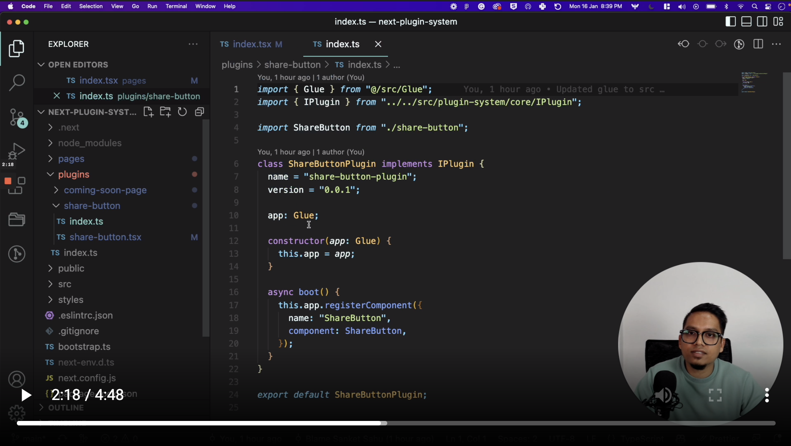

# Next.js WordPress-like Plugin System 🚨 (Experimental)

> ⚠️⚠ This is an experimental project, a proof-of-concept to bring WordPress like, file-based plugins to Next.js. ⚠⚠️

## Why?

Taking inspirations from the WordPress Plugin system. Wouldn't it be easy if we could install plugins for **Google Analytics**, **Social Login**, **E-commerce** (maybe) and customize as you need!

## Demo

[](https://www.loom.com/share/5354c3e306cb41ec92daa4b00130c5bd "Next.js WordPress-like Plugin System")

## The checklist (from WordPress)

- [x] File-system based
- [ ] Persistant Store per plugin
- [x] Register Components
- [x] Register Routes
- [ ] Register Functions
- [ ] Event System across plugins
- [ ] Dependency management

## The state of this experiment

This is a very early experiment that has two plugins

- **ShareButtonPlugin**: Registers a ShareButton component that can be used anywhere in the app.

- **ComingSoonPlugin**: Registers a route `/coming-soon` using the Dynamic Routes of Next.js.

## Folder structure

```
bootstrap.ts
src/
plugins/
    share-button/
    coming-soon-page/
pages/
    [...all].tsx
```

```
Note:
- bootstrap.ts is used to initialize the plugin-system
- src folder contains the source code of the plugin-system
- plugins folder contains the individual plugin folders
- pages folder contains the dynamically rendered routes registered by the plugins
```

## Running the dev environment

First, run the development server:

```bash
npm run dev
# or
yarn dev
# or
pnpm dev
```

Open [http://localhost:3000](http://localhost:3000) with your browser to see the result.
